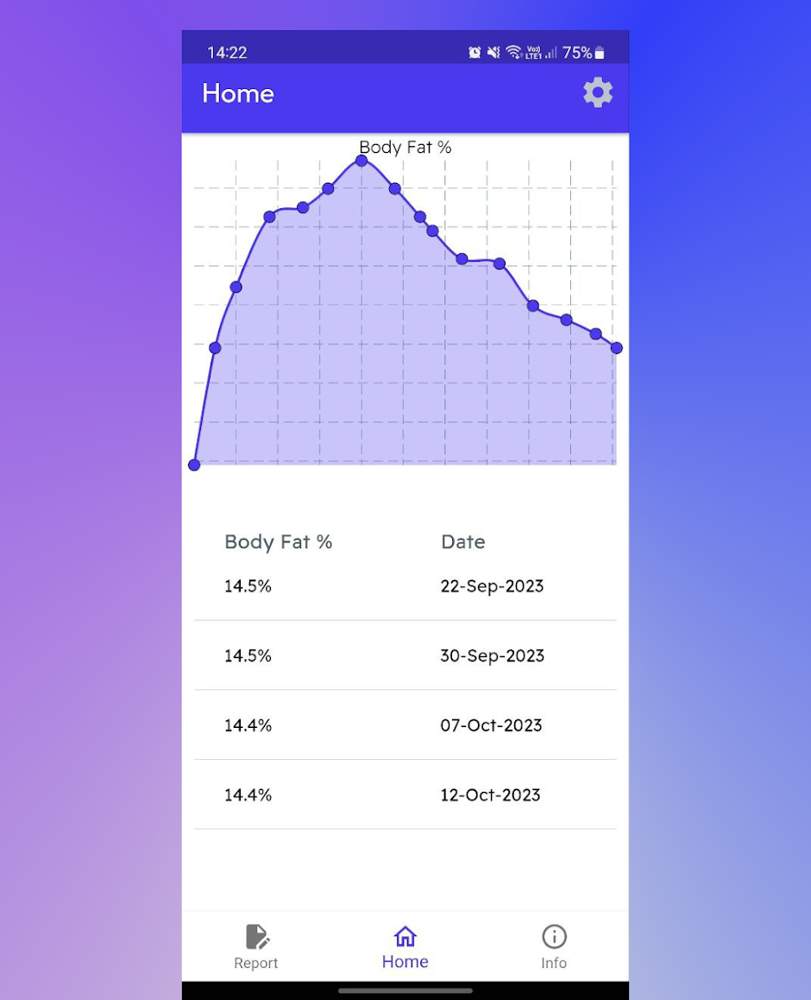
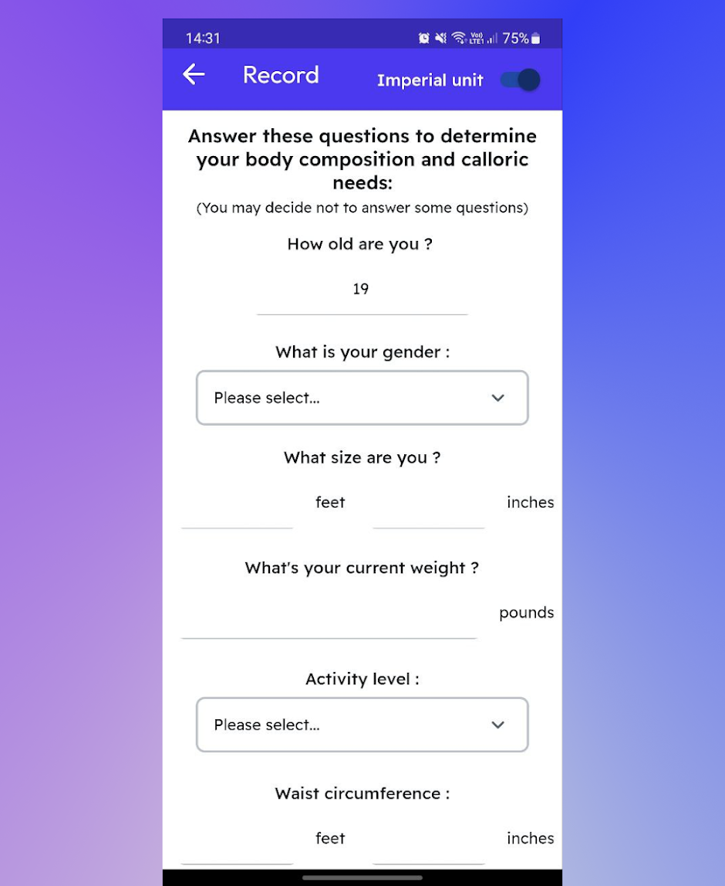
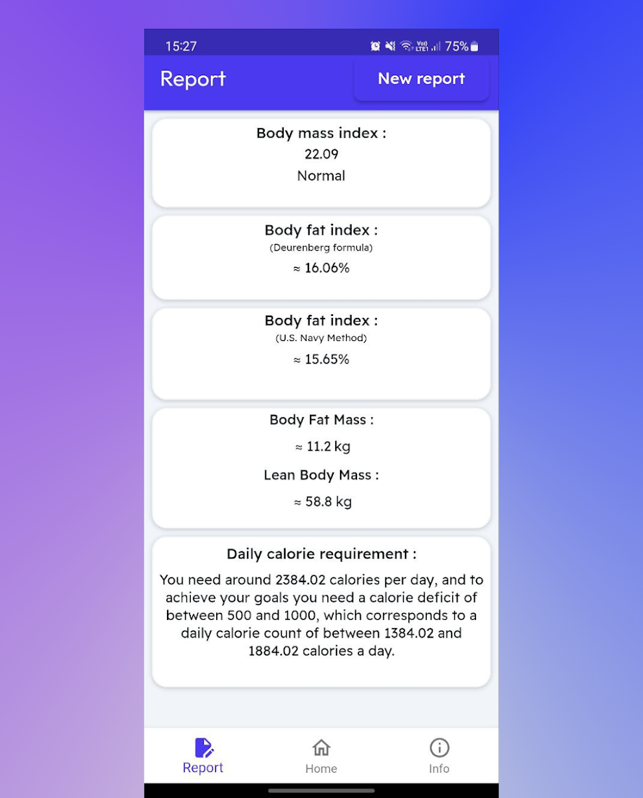

# 💙 Body Composition - Mobile Application

## 📌 Description
**Health Tracker** is a mobile application designed to monitor body composition and caloric needs. With an intuitive interface, it helps users track their body fat percentage, BMI, and daily calorie requirements.

🚀 *This application was developed using **FlutterFlow**, enabling fast and efficient development.*

## 🖼️ Screenshots
### 📊 Body Fat Percentage Tracking

### 📝 Personal Information Input

### 📋 Body Index Calculations and Caloric Needs
